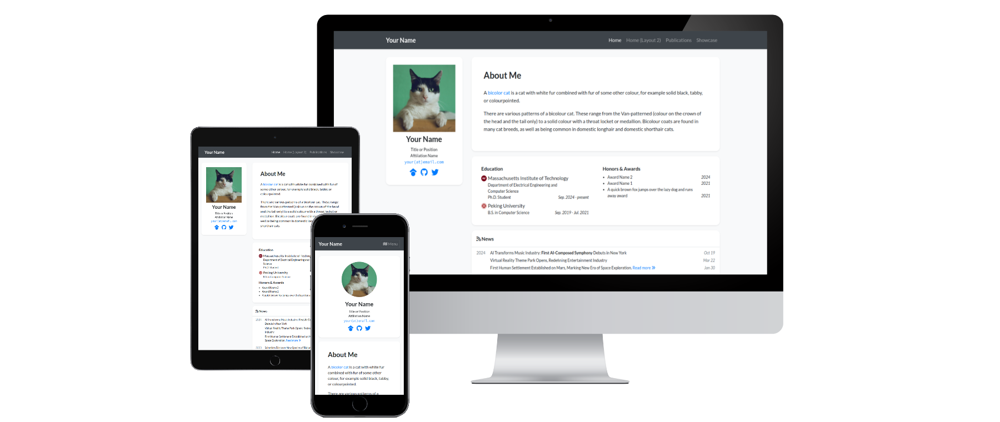

# academic-homepage

[](https://luost26.github.io/academic-homepage/)

[](https://github.com/luost26/academic-homepage/actions/workflows/pages/pages-build-deployment)
[](https://hits.sh/github.com/luost26/academic-homepage/)
[](https://github.com/luost26/academic-homepage)
[](https://github.com/luost26/academic-homepage/forks)
<!--[](https://validator.nu/?doc=https%3A%2F%2Fluost26.github.io%2Facademic-homepage)-->

A GitHub Pages (Jekyll) template for personal academic website. Click [here](https://luost26.github.io/academic-homepage/) to see the demo.

## User Community

[🏡](https://luost.me/)
[:star:](https://cch1999.github.io/)
[:star:](https://kyrrego.github.io/)
[:star:](https://ced3-han.github.io/)
[:star:](https://lihengchen.com/)
[:star:](https://hpwang-whu.github.io/)
[:star:](https://zhang-yingyi.github.io/)
[:star:](https://wby24.github.io/)
[:star:](https://pengfeixu.com/)
[:star:](https://boqiuphd.github.io/)
[:star:](https://www.huabing.li/)
[:star:](https://xiecuiying.github.io/)
[:star:](https://hannyang.github.io/)
[:star:](https://king-play.github.io/)
[🤖](https://andrewcwlee.github.io)
[:star:](https://laiyao1.github.io)
[🌜](https://tmsultan.github.io)
[🚀](https://zaxguo.github.io)
[:gemini:](https://hongyang-du.github.io)
[:star:](https://thuanz123.github.io)
[🧬](https://gdalba.github.io/)
[:star:](https://yhhan.com/)
[🌔](https://chen-huaneng.github.io/academic)
[:star:](https://jwklee.github.io/)
[😺](https://onethousandwu.com/)
[🔬](https://kwen-chen.github.io/)

:hugs: Feel free to tell us if you are using this template for your website by creating an issue [here](https://github.com/luost26/academic-homepage/issues/new?assignees=&labels=&projects=&template=user-report.md&title=I+am+using+this+template%21).

### Acknowledgements

The improvements of this template have been inspired by the customizations and feedbacks from the following users:
- 😺 [onethousandwu.com](https://onethousandwu.com/): increased corner radius [[Repo]](https://github.com/oneThousand1000/oneThousand1000.github.io)
- :star: [shiwonkim.github.io](https://shiwonkim.github.io/): two-column main page layout [[Repo]](https://github.com/shiwonkim/shiwonkim.github.io)
- :star: [yqxie99.github.io](https://yqxie99.github.io/): blog feature [[Repo]](https://github.com/YQXie99/YQXie99.github.io/tree/feat/add_blog_page)

## Need Help?

If you run into **any** issues while using this template, or have suggestions for improvements, please don't hesitate to create an issue [here](https://github.com/luost26/academic-homepage/issues/new).

### FAQs

- [Need blogging feature?](https://github.com/luost26/academic-homepage/issues/13#issuecomment-2646371324)
- [How to show citation count for papers?](https://github.com/luost26/academic-homepage/issues/29#issuecomment-3222496187)


## Getting Started

1. First, click the "Use this template" button to create a new repository. The name of the repository should be `<your-github-username>.github.io` (click [here](https://docs.github.com/en/pages/getting-started-with-github-pages/about-github-pages#types-of-github-pages-sites) to learn more about naming a GitHub Pages repository).

### Running Locally (Debug & Preview)

Use the Ruby version in `.ruby-version` and the Bundler version recorded in
`Gemfile.lock`. In the repository directory, run:

```bash
bundle install
bundle exec jekyll serve --livereload
```

Open <http://127.0.0.1:4000/>. Saving a source file rebuilds the site and refreshes
its browser preview. Restart the server after changing `_config.yml`.

### Deploying to GitHub Pages

The [homepage workflow](.github/workflows/pages.yml) builds and deploys each push
to `main`. In repository Settings → Pages, select **GitHub Actions** as the source.
The workflow can also be started manually from the Actions tab.

Local development and GitHub Actions use `.ruby-version` and the committed
`Gemfile.lock`. CI installs locked dependencies and runs Jekyll directly. When
intentionally updating dependencies, commit the updated lockfile after checking
the local preview.

After a successful deployment, view <https://minervazz.github.io/>.
